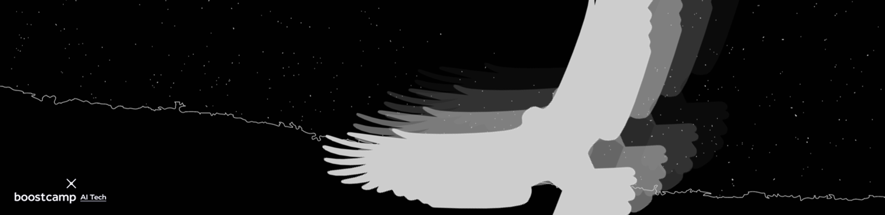

<div align="center"> 
    
</div>

## ✨ [Notion](https://www.notion.so/Eagle-Eye-018f370b1ce4436081ad646eb7ee3d69)

모델 학습은 mmdetection 라이브러리를 사용하며, config관련 실험은 모두 Notion에서 이루어집니다!

---

## 📁 폴더 구조

```
├── code            # 추가적으로 구현한 코드 모음
└── config          # 팀원별 config 파일
    ├── arm
    ├── bsoomin
    ├── jaehyuk
    ├── jiyoung
    ├── jsj
    └── sohyun
```

---

## 👋 팀원 소개

|                                                                                      박소현                                                                                      |                                                             배수민                                                             |                                                          이아름                                                           |                                                            정지영                                                            |                                                            조성진                                                             |                                                            최재혁                                                             |
| :------------------------------------------------------------------------------------------------------------------------------------------------------------------------------: | :----------------------------------------------------------------------------------------------------------------------------: | :-----------------------------------------------------------------------------------------------------------------------: | :--------------------------------------------------------------------------------------------------------------------------: | :---------------------------------------------------------------------------------------------------------------------------: | :---------------------------------------------------------------------------------------------------------------------------: |
| <a href='https://github.com/CoodingPenguin'></a> | <a href='https://github.com/bsm8734'></a> | <a href='https://github.com/areum514'></a> | <a href='https://github.com/bitwarrior1'></a> | <a href='https://github.com/Jo-ad-fontes'></a> | <a href='https://github.com/opijae'></a> |

---

## 👀 회고

> **[👉 회고 보러가기](https://github.com/CoodingPenguin/object-detection-for-recycling-items/wiki)**

- 대회 개요
  - 배경
  - 문제 정의
  - 평가지표: mAP50
- 대회 결과
- 접근 방법
  - 새로운 협업 방식 도입
  - mmdetection 사용법 익히기
  - 모델 실험
  - 회고와 새로운 계획
  - Augmentation 기법 실험
  - 그 외
- 회고
